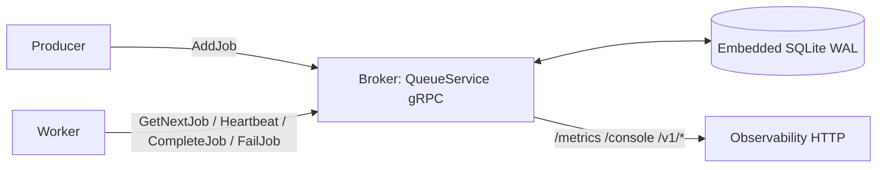

# AnvilMQ

AnvilMQ is an early-stage Rust queue engine intended for autonomous regional Kubernetes deployments. The current implementation is a single-process gRPC server with embedded SQLite persistence, atomic enqueue/dequeue, and a caller-supplied execution-depth guard. Sub-millisecond latency, high availability, and tenant rate limiting are goals, not verified capabilities.

## Components

AnvilMQ is a single **broker** process that owns an embedded SQLite database; **producers** and **workers** are your own processes that talk to it over gRPC. There is no separate storage tier, coordinator, or message bus — the broker is the whole server.

- **Broker.** The `QueueService` gRPC server. It owns the embedded SQLite store (a single shared writer connection with WAL, plus an isolated read-only replica for inspection) and performs every state transition as an immediate transaction. Workers never touch the database directly; all queue operations go through its RPCs.
- **Producer.** Any client that enqueues work with `AddJob` (optionally with a delay, priority, ancestry `parent_id`, rate-limit facet, or `idempotency_key`). A producer need not stay connected after enqueue.
- **Worker.** A client that pulls and runs jobs: `GetNextJob` claims one job under a time-boxed lease, `Heartbeat` renews the lease during long work, and `CompleteJob`/`FailJob` acknowledge the outcome. Each acknowledgment carries the job's `attempt` token so the broker can verify ownership. Handlers should be idempotent (see [Delivery and execution semantics](#delivery-and-execution-semantics)).
- **Client library.** A repo-local TypeScript/Bun client wraps the gRPC contract as `Queue` (producer), `Worker`, and the administrative `RateLimits`/`IngressLimits` helpers. Any gRPC-capable language can generate its own bindings from `proto/queue.proto`.
- **Store.** A single embedded SQLite database owned by the broker (jobs, history, enqueue receipts, and rate-limit/fairness bookkeeping). It is not shared with any other process.
- **Two surfaces.** Queue operations use the gRPC control plane (`QueueService`). A separate HTTP port serves observability: `/metrics` (Prometheus), `/healthz`, `/readyz`, a built-in `/console`, and read-only inspection at `/v1/failures`, `/v1/rejections`, `/v1/search`, and `/v1/jobs/:id` — served from the read-only replica so inspection never contends with the write path.



## Current architecture

For a versioned container, Helm chart, and packaged Bun client, see [evaluation releases and Azure deployment](docs/release-and-deploy.md). The chart deploys one broker with FULL durability and a dedicated PVC; it does not provide HA yet.

- Rust Edition 2021, Tokio, and Tonic/Protocol Buffers.
- Bundled SQLite through `rusqlite`. AGENTS.md describes the storage layer as libSQL; in practice the broker standardizes on the bundled `rusqlite` SQLite build (the amalgamation ships FTS5 and WAL in-box), and the earlier "migrate to libSQL" question is resolved in its favor.
- Database work runs in `spawn_blocking`, with one shared connection protected by a mutex.
- WAL with configurable `ANVILMQ_DURABILITY=NORMAL|FULL` (default NORMAL). NORMAL permits loss of recent acknowledged writes after OS/power failure; FULL requests commit synchronization on retained storage. Startup logs the applied settings. See the [durability contract](docs/durability.md) for storage assumptions and operational guidance.
- Initial schema creation and additive ownership/error-history migrations run in a transaction. Existing jobs are preserved.

## Delivery and execution semantics

AnvilMQ delivers each job **at least once**. It does **not** provide exactly-once execution of a handler's external side effects, and it does not try to. This is a deliberate choice; this section states the guarantee and defends it.

### The guarantee

Within the configured attempt limit and the storage's durability settings:

- **No acknowledged job is silently lost.** Every transition (enqueue, claim, heartbeat, completion, failure, recovery) is an immediate, durable transaction, so a committed job survives restarts and is eventually completed, retried, or moved to Failed history.
- **A job may run more than once.** If the broker cannot be certain a claimed job finished, it re-dispatches the job after its lease expires, so handlers must be idempotent.

That is the whole trade-off: under crashes and partitions a queue can guarantee it never loses a job (at-least-once) or never duplicates a job (at-most-once), but not both. AnvilMQ chooses never-lose, because a dropped job is usually far worse than a duplicate an idempotent handler can absorb.

### Why exactly-once execution isn't offered

A worker performs side effects in external systems the broker does not control. Exactly-once execution would require performing the side effect and durably recording "done" as one atomic step. Whenever the worker or broker can crash between those two, that atomicity is impossible in general: the broker cannot distinguish "the handler finished but the acknowledgment was lost" from "the handler never ran." Duplicates therefore arise from:

- **A lost completion acknowledgment** — the handler committed its side effect, then the `CompleteJob` call (or the worker) died before the broker recorded it; the lease expires and recovery re-runs the job.
- **A lease reclaimed under a slow handler** — a long pause (GC, I/O stall, or clock skew) lets the 30-second lease expire while the worker is still running, so recovery hands the job to another worker and both may execute it.
- **A retried enqueue** — a producer that resends `AddJob` after a timed-out-but-committed call creates a second job unless it supplied an `idempotency_key`.

Systems that advertise exactly-once either confine every side effect to the same transactional store as the queue (not possible for general external effects) or actually mean *effectively once*: at-least-once delivery plus de-duplication at the effect boundary. AnvilMQ takes the honest version of that.

### Reaching *effectively once*

The broker de-duplicates everything it can reach and hands you stable keys for the rest:

- **Ownership-checked acknowledgments.** Completion, failure, and heartbeat require a matching, unexpired claim carrying the dequeue's `attempt` token, so a stale claim can never acknowledge or renew a newer one.
- **Completion idempotency.** Replaying `CompleteJob` for an already-completed job returns success from history without re-writing history or double-counting metrics. This de-duplicates the broker-side transition, not the external effect.
- **Enqueue idempotency.** An opt-in `idempotency_key` collapses producer retries into one job; see [Idempotent enqueue](#idempotent-enqueue).
- **A stable job identity.** Every dispatch carries the job `id`, unchanged across re-executions; use it (or your own business key) as the natural key for effect de-duplication. Do not key on the `attempt` number — a duplicate run has a different attempt.

Make handler side effects idempotent (natural keys, upserts, conditional writes, or a transactional outbox keyed on the job `id`) and at-least-once delivery becomes effectively-once at the point where exactly-once can actually be enforced: inside the system that owns the side effect.

### Why this is the right choice

- **It is honest.** The guarantee matches what a crash-safe queue can truly deliver, with no hidden window where a job is silently dropped or assumed to run exactly once when it cannot be.
- **It stays fast and local.** True exactly-once across external systems needs a distributed commit protocol spanning the worker's downstream dependencies, which contradicts AnvilMQ's embedded, low-latency design. At-least-once keeps the hot path a single local transaction.
- **It composes with best practice.** Idempotent handlers are already the norm for reliable processing; AnvilMQ supplies the primitives (stable `id`, `attempt` ownership, enqueue dedup key, completion replay) so you enforce exactly-once effects exactly where you can — at the boundary you control.

## Implemented behavior

### Enqueue

`AddJob` persists a UUID, payload, priority, ancestry metadata, attempts limit, timestamps, and optional rate-limit facet. Missing trace IDs are generated. Parentage is built-in: a caller declares only `parent_id` and the server owns the derived lineage facts (`execution_depth` and `trace_id`). Execution depth greater than the configured maximum (10) is rejected — the supplied value is cheaply pre-checked, and the authoritative circuit-breaker check runs on the *derived* depth after parent resolution. When `parent_id` is supplied, ancestry is validated against the referenced record (see below). An immediate transaction atomically inserts the job and, when requested, its idempotency receipt.

Optional `idempotency_key` (protobuf tag 10) deduplicates within the exact job/queue `name`. Empty/omitted means ordinary enqueue; nonempty keys must be nonblank and at most 256 UTF-8 bytes. Matching retries return the original ID and initial enqueue state with `replayed=true` (response tag 3), even after completion or failure. This is an enqueue receipt, not a current-state query. Replays do not reset delays, create another job, consume attempts, or increment the enqueued counter.

### Ancestry validation and runaway-chain quarantine

The execution-depth cap only holds if callers honestly propagate and increment `execution_depth`. Two enqueue-time controls harden this, both evaluated inside the existing immediate transaction using indexed point lookups so the hot path stays cheap. They are backward compatible: an enqueue with no `parent_id` (and with the chain cap unset) behaves exactly as before.

- **Ancestry integrity** applies only when `parent_id` is supplied. The parent is resolved by primary key across the live `jobs` table and `job_history`. A missing parent is rejected with `FAILED_PRECONDITION`. Parentage is **built-in**: the child's `execution_depth` is server-owned. A supplied `execution_depth` of `0` (the default) is **derived** as `parent.execution_depth + 1`; a supplied non-zero value must equal `parent.execution_depth + 1` or the enqueue is rejected with `INVALID_ARGUMENT` (a bug-catcher for callers that hand-roll depths). The derived depth then feeds the authoritative circuit breaker, so a child whose lineage would exceed the maximum execution depth is rejected with `RESOURCE_EXHAUSTED` even though the supplied `0` passed the cheap pre-check. When a valid parent is found, the child **inherits the parent's `trace_id`** authoritatively — any supplied or absent `trace_id` is overridden with the parent's lineage id. This closes the quarantine-evasion hole for callers that would otherwise vary `trace_id` per hop; correct callers that already propagate the parent's `trace_id` are unaffected. Root jobs (no `parent_id`) keep generating/using their own `trace_id` and their supplied depth as before. This backs the AGENTS.md "Enforce depth checks" rule with a verified parent relationship rather than a self-reported counter.

- **Runaway-chain quarantine** bounds the total number of jobs spawned within a single lineage, keyed by the root-chain `trace_id`. A per-trace counter (`chain_counters`) is upserted in the same transaction. Once the count reaches `ANVILMQ_MAX_CHAIN_SIZE`, further enqueues in that lineage are quarantined and rejected with `RESOURCE_EXHAUSTED` ("chain quarantined"). The cap is configurable and safely disable-able: `0` or unset disables enforcement entirely (and skips all counter writes), so it can be turned off under pressure. Idempotent replays/conflicts return before this logic and never count.

Idle `chain_counters` rows are reclaimed by the retention sweeper: a lineage whose counter has not been touched within `ANVILMQ_MAX_CHAIN_COUNTER_TTL_MS` (default 7 days; `0` disables the prune) is deleted in bounded batches, so the table does not grow unbounded across a long-lived process. Metrics `anvilmq_ancestry_rejections_total`, `anvilmq_chain_quarantines_total`, and `anvilmq_chain_counters_pruned_total` surface on `/metrics`.

**Durable rejection records.** Every admission-time enqueue rejection — across all five kinds (`ingress_velocity`, `parent_not_found`, `inconsistent_depth`, `circuit_breaker`, `chain_quarantine`) — is durably recorded to the `enqueue_rejections` table for post-hoc forensics. This matters because a rejected enqueue creates no job row: before this, the only trail was an aggregate counter plus a transient log line, both gone the moment you needed them. Each row captures `kind`, `name`, `trace_id`, `parent_id`, `execution_depth`, `rate_limit_facet`, and `detail`, so an operator can trace a circuit-breaker or chain-quarantine rejection back to the offending workflow even after the referenced lineage has been pruned from job history. The records are queryable via `GET /v1/rejections` and surfaced per-kind on `/metrics` by `anvilmq_enqueue_rejections_total{kind}`.

| Env var | Default | Meaning |
| --- | --- | --- |
| `ANVILMQ_MAX_CHAIN_SIZE` | `0` (disabled) | Max jobs per lineage (`trace_id`) before further enqueues are quarantined. |
| `ANVILMQ_MAX_CHAIN_COUNTER_TTL_MS` | `604800000` (7d) | Idle age after which a lineage counter row is pruned by the retention sweeper. `0` disables the prune. |

### Delays and retry backoff

`delay_ms` sets the initial persisted `available_at` timestamp. Zero is immediately eligible; positive delays return state Delayed. Dequeue directly claims due jobs (`available_at <= server time`) without a separate promotion loop.

New per-job protobuf fields `retry_backoff_ms` (tag 8) and `retry_backoff_max_ms` (tag 9) configure retries. Base zero preserves immediate retries. A zero cap selects `max(60000, base)` milliseconds; an explicit cap must be at least the base. Negative delays/backoff values and overflowing initial timestamps return InvalidArgument.

After attempt N fails, delay is `min(base * 2^(N-1), cap)`. For base 1000 and cap 10000, delays are 1s, 2s, 4s, 8s, then 10s. The same policy applies to expired leases, measured from recovery time. Positive retries enter Delayed; zero-delay retries enter Waiting. Exhausted jobs go straight to Failed history. Arithmetic saturates to avoid overflow; no jitter is applied.

Due times and policies survive restart. Existing jobs default to zero backoff; legacy Waiting jobs remain eligible. These timestamps use the server wall clock, so clock adjustments can change scheduling timing.

### Dequeue

`GetNextJob` atomically claims at most one `Waiting` job:

1. Require a nonblank `worker_id`; reject blank entries in `queue_names`.
2. Filter by exact job `name` matches. An empty list polls all names; the current contract has no separate queue identifier.
3. Select by ascending numeric priority (lower numbers first), then oldest `created_at`, then ID for deterministic ties.
4. Set the job to `Active`, persist `worker_id` and a 30-second lease expiration, increment `attempts`, and update its timestamp in one immediate transaction.
5. Commit before returning the payload, metadata, and incremented attempt count. The first claim returns `attempts=1`.

When no matching work exists, the response has `found=false`. Active jobs and jobs with future or unknown due times are excluded. Due Waiting and Delayed jobs are eligible. Concurrent polls cannot claim the same Waiting job; database write contention waits up to five seconds before returning an error.

The response includes `lease_expires_at_ms` (Unix epoch milliseconds). Workers must finish or renew before this deadline. A lost dequeue response consumes an attempt; recovery makes the job eligible again if attempts remain.

### Worker leases and recovery

Call `Heartbeat` with `id`, `worker_id`, and the positive `attempt` from dequeue. A successful heartbeat returns the renewed `lease_expires_at_ms`, at least 30 seconds from server time when the transaction obtains its write lock. Send heartbeats approximately every 10 seconds while executing.

For live jobs, heartbeat, completion, and failure require a matching, unexpired Active claim. Expiration is inclusive (`deadline <= server time`). Expired claims return FailedPrecondition even before recovery runs; a heartbeat cannot resurrect them. A stale attempt cannot acknowledge or renew a newer claim, including when the same worker ID is reused. Already committed completions can be replayed as described below. Stop processing when ownership is lost; the broker cannot cancel external side effects already in progress.

The daemon runs recovery immediately on startup and every five seconds thereafter. Each immediate transaction handles up to 100 expired claims. Jobs with attempts remaining are rescheduled using their backoff policy with ownership and lease cleared; exhausted jobs move atomically to Failed history. Recovery records `Worker lease expired`, preserves the attempt count, and logs recovered counts or errors. Failed batches roll back and retry on the next tick. Large backlogs may take multiple ticks to drain.

Lease duration is currently a fixed `LEASE_DURATION_MS = 30_000` in `src/leases.rs`; the recovery interval is five seconds in `src/main.rs`. Runtime configuration is not implemented. Expirations persist across restarts and use the server's wall clock; keep the host clock synchronized. Forward clock jumps can expire work early, and backward jumps can delay recovery.

Delivery is at-least-once; see [Delivery and execution semantics](#delivery-and-execution-semantics).

On upgrade, stop old workers before starting this version. The additive migration preserves existing jobs and treats legacy Active jobs without a lease as expired for immediate recovery. Existing unexpired leases are preserved on restart. Older clients that cannot heartbeat must finish within 30 seconds.

### Completion, failure, and retries

`CompleteJob` verifies that the job is Active and owned by the requesting worker, inserts a Completed history record, and deletes the live job in one immediate transaction. History preserves payload, ancestry, priority, attempt counts, creation time, finish time, worker, facet, and the most recent failure message (if any).

`FailJob` performs the same ownership checks and records `error_message`. If `attempts < max_attempts`, it reschedules the job and clears worker ownership; `moved_to_failed_state=false`. Otherwise it atomically moves the job to history as Failed and returns `moved_to_failed_state=true`. Attempts increment only on dequeue. `max_attempts=0` at enqueue defaults to three total attempts. Retries retain original priority/creation time and follow the per-job backoff policy below. Only the latest error is retained, not a per-attempt log.

Workers must send the dequeue response's `attempts` as `attempt` in completion/failure requests. This prevents acknowledgments from an older claim affecting a later claim by the same worker.

Acknowledgments return success only after commit. If a completion response is lost, repeating `CompleteJob` with the same job ID, worker ID, and successful attempt returns success from the Completed history record, including after restart. Zero remains an alias for attempt one. Replays do not change history or increment transition/state metrics; RPC latency metrics still count each request. The original lease need not remain valid once completion has committed.

Blank IDs return InvalidArgument, unknown jobs return NotFound, and an incorrect Active-job owner returns PermissionDenied. Non-Active live jobs, stale attempts, and archived records with a different owner, attempt, or outcome return FailedPrecondition without mutation. `FailJob` replays remain rejected. Completion receipts last as long as the history record is retained; legacy records without worker identity cannot prove a match. These ownership checks compare caller-provided identifiers; they are not authentication, and completion idempotency does not deduplicate external handler side effects.

## Known limitations

- Legacy Delayed jobs created before persisted scheduling have unknown due times and remain unscheduled. Inspect and explicitly reschedule them; the migration does not guess their original delay.
- Both rate-limit mechanisms match facets exactly (no wildcard or pattern matching): the dispatch-side faceted rate limits use fixed windows, while the admission-side ingress velocity limits use a sliding-window-counter approximation. Weighted tenant fairness is not implemented, though equal (unweighted) round-robin fairness across facets is available opt-in; see [Tenant fairness](#tenant-fairness).
- The server defaults to loopback. A non-loopback bind requires an explicit `ANVILMQ_ADDR`; transport authentication/TLS are not implemented.
- No Raft replication or global telemetry exists yet.

## Roadmap

### Phase 1: Core plumbing

- [x] Rust project and core protobuf contract.
- [x] Tonic server bootstrap.
- [x] Embedded SQLite connection, WAL, and initial schema.
- [x] Resolve the libSQL target versus current rusqlite implementation: standardized on the bundled `rusqlite` SQLite build.

### Phase 2: Transactional lifecycle (current focus)

- [x] Atomic enqueue and priority index.
- [x] Atomic Waiting -> Active dequeue with queue filtering and worker ownership.
- [x] Transactional completion/failure, ownership checks, and job history.
- [x] Immediate retries up to the attempt limit and stale-acknowledgment protection.
- [x] Persisted worker leases, heartbeat renewal, and abandoned-job recovery.
- [x] Retry backoff and persisted delayed scheduling.
- [x] Background retention sweep bounding job history and idempotency receipts (age + per-name count), matching the retention policy of the queue system it replaces (bounded completed/failed history by age and per-name count).
- [x] Initial TypeScript/Bun client with JSON enqueue, worker heartbeats, graceful draining, and a real gRPC demo/test. It defines its own gRPC contract and is not a drop-in replacement for any existing queue client.

### Phase 3: Safety controls

- [x] Persist metadata and reject supplied execution depth above the limit.
- [x] Validate ancestry and quarantine runaway chains.
- [x] Built-in parentage: the server derives `execution_depth` from the resolved parent when unset and validates a supplied non-zero depth against it, and the client exposes an `enqueueChild` helper that propagates the parent's lineage.
- [x] Sliding-window ingress velocity controls.

### Phase 4: Faceted rate limiting

- [x] Rule/counter tables and stored job facet.
- [x] Exact-match rule management/usage RPCs and atomic fixed-window enforcement during dequeue.
- [x] Fairness across tenants/departments.

### Phase 5: Regional high availability

- [ ] Raft consensus and replicated state transitions.
- [ ] Kubernetes configuration, persistent storage, and failure testing.

### Phase 6: Observability

- [x] Atomic lifecycle metrics, RPC latency histograms, and an axum Prometheus endpoint.
- [x] Structured transition logs and health/readiness probes.
- [x] Cached queue-pressure depth/age, claim-wait histograms, and Grafana dashboard/Prometheus alert examples. See [queue-pressure observability](docs/observability.md).
- [x] Read-only replica connection (WAL) with bounded concurrency and per-query timeouts for observability/search reads, isolated from the single-writer path so heavy reads never stall enqueue/claim/complete.
- [x] Per-function overview panel (throughput, failure rate, and latency per job name), shipped as an importable Grafana dashboard packaged for the chart's Grafana sidecar.
- [x] All-names / auto-registered-up-to-a-cap metric mode so every function appears without unbounded producer-label cardinality (opt in with `ANVILMQ_METRICS_MODE=all`, bounded by `ANVILMQ_METRICS_MAX_NAMES`; the allowlist path via `ANVILMQ_METRICS_QUEUES` remains the default).
- [x] Recent-failures feed endpoint (`GET /v1/failures`) served off the read-only replica, showing terminal failures (name, finished_at, last_error, attempts, trace_id); excludes in-flight retries since only exhausted failures reach job_history.
- [x] Grafana table over the recent-failures feed (via a JSON/Infinity datasource): the `anvilmq-failures` dashboard renders `GET /v1/failures` as a table through the `yesoreyeram-infinity-datasource` plugin, honoring the dashboard time range via `since_ms`. See [dashboard docs](docs/observability.md#dashboard-and-alerts).
- [x] Read-only job/history search API served off the replica connection: opt-in FTS5 index maintained by triggers at history-insert/delete time (off the hot enqueue path, off by default, retention-bounded), including whole-token prefix search via an explicit trailing `*` (`upstrea*`). Enable with `ANVILMQ_FTS_ENABLED`; see [search observability](docs/observability.md#search).
- [x] Read-only job/history search API served off the replica connection (`GET /v1/search`): structured filters plus escaped-LIKE free-text search over `job_history` (no write-path cost, retention-bounded), with an opt-in FTS5 `MATCH` path when `ANVILMQ_FTS_ENABLED` is set.
- [x] Read-only single-job detail endpoint (`GET /v1/jobs/{id}`) served off the replica connection: the full record for one job — including the payload and ancestry — unioning the live `jobs` table and `job_history` via a `source` discriminator.
- [x] Console click-through from a search result to the single-job detail view (`GET /v1/jobs/{id}`): select a row to open the full record inline — notably `last_error` for a failed job — so failure triage is a one-click step instead of a hand-built request.
- [x] Durable admission-time enqueue-rejection records (`enqueue_rejections`) with a read-only feed (`GET /v1/rejections`) served off the replica connection: every rejected enqueue — which creates no job row — is captured with `kind`, `name`, `trace_id`, `parent_id`, `execution_depth`, `rate_limit_facet`, and `detail` for post-hoc forensics, counted per-kind by `anvilmq_enqueue_rejections_total{kind}`, and retention-bounded by `ANVILMQ_RETENTION_REJECTIONS_AGE_MS`.
- [ ] Asynchronous regional telemetry aggregation.
- [ ] Latency and throughput benchmarks with documented durability settings.

## Idempotent enqueue

Enqueue idempotency makes a repeated `AddJob` safe: when a producer retries the same submission — after a timed-out call, a dropped connection, or a crash and restart — the broker returns the original job instead of creating a duplicate. It is opt-in per request through `idempotency_key` and scoped to the exact queue `name`; unkeyed enqueues take the ordinary path and store nothing extra.

### How a keyed enqueue is resolved

On the first keyed enqueue the broker writes an enqueue receipt into `enqueue_receipts`, keyed by `(queue_name, idempotency_key)`. The receipt stores the normalized request bytes (captured before the job UUID and timestamps are generated), the resulting `job_id`, and the job's `initial_state`. The job insert and the receipt insert commit in the same immediate transaction, so a job never exists without its receipt or the reverse. A later keyed enqueue has three outcomes: new key -> insert job+receipt, return `replayed=false`; matching replay (byte-identical normalized request) -> return the original `job_id` and stored `initial_state` with `replayed=true`, creating no second job and consuming no attempt; conflict (receipt exists, request differs) -> return `AlreadyExists` and change nothing.

### Receipt versus status

A matching replay returns the job's INITIAL state (`Waiting`, or `Delayed` if you supplied `delay_ms > 0`) — frozen in the receipt — not the job's live state. It answers "was this already submitted, and what is its ID?", never "what is this job doing now?".

```
t0  AddJob(key=K)       -> job J created, state=Waiting, receipt{J,"Waiting"} written
t1  worker claims J     -> J is Active
t2  worker finishes J   -> J is Completed (later copied to history, maybe pruned)
t3  retry AddJob(key=K) -> { id: J, state: "Waiting", replayed: true }
```

At t3 the job is finished, yet the reply still says `Waiting`. The meaningful signals are `replayed=true` (nothing new was created) and the returned id. Query the job by id for live progress. A receipt outlives its job — reclaimed only once the job is gone from both the live and history tables — so a replay can still report `Waiting` after the original was retention-pruned.

### Designing keys

Reuse the same key and the same request across retries and restarts of the same logical work; use a new key for genuinely new work. Because comparison is byte-for-byte on the normalized request, the payload must be serialized identically across retries.

```typescript
const receipt = await queue.add(
  { invoiceId: "123" },
  { idempotencyKey: "tenant-a:generate-invoice:123:v1" },
);
if (receipt.replayed) {
  // A prior submission already created this job; do not treat it as new work.
}
```

### Durability, cost, and metrics

Receipts survive restarts and terminal transitions and, in this first version, have no standalone TTL: a receipt is removed only once retention has dropped its job from both the live and history tables, so the dedup window tracks job retention exactly. Each receipt stores the full normalized request including payload, so keyed jobs add storage. The `anvilmq_enqueue_receipts` gauge tracks the retained count, `anvilmq_enqueue_replays_total` counts matching replays, and `anvilmq_enqueue_conflicts_total` counts rejected key reuse. Idempotency covers job creation only — handler side effects remain at least once.

## Faceted rate limits

`UpsertRateLimitRule(facet_pattern, max_jobs, window_duration_ms)` creates or replaces an exact-match rule. Wildcards (`*`, `?`), blank keys, surrounding whitespace, and nonpositive/overflowing durations are rejected. `max_jobs=0` pauses claims for that facet. **Every upsert resets usage**, including an identical update; do not repeatedly upsert rules as a reconciliation heartbeat.

`DeleteRateLimitRule(facet_key)` removes the rule and counter; repeated deletion returns `deleted=false`. `GetRateLimitStatus(facet_key)` reports rule existence, effective count, limit, duration, window expiration, and throttling. An expired or unstarted window reports count/deadline zero without writing to the database. Missing rules mean unrestricted claims.

Windows start on the first claim and remain fixed until expiry (`expires <= now` resets on the next claim). The `rate_limit_facet` is a free-form label set per job at enqueue (the client's `rateLimitFacet` option), not a per-queue setting; a queue here is just the job `name`. Because the counter is keyed solely by facet, every job carrying a given facet draws on one shared quota regardless of the `name` it was enqueued under. Each claim consumes one unit, including retries and recovered jobs. Completion/failure does not refund usage. Counter changes and the claim commit together; failed claims roll back quota consumption. Rules and counters persist across restarts. These are dispatch-rate limits, not concurrency limits or enqueue admission controls.

Dequeue skips throttled candidates and preserves priority/age ordering among eligible jobs; a blocked tenant cannot prevent an eligible different facet from progressing. This is not a round-robin fairness guarantee. If all matching jobs are throttled, polling returns `found=false`; the client continues normal polling. Jobs without a matching rule remain unrestricted. Limits depend on caller-supplied facets and trusted administrative access; they are not an authorization boundary.

The TypeScript client exports `RateLimits`:

```typescript
const limits = new RateLimits();
await limits.upsert("practice:123", 100, 60000);
console.log(await limits.status("practice:123"));
await queue.add(data, { rateLimitFacet: "practice:123" });
// await limits.delete("practice:123");
limits.close();
```

`anvilmq_throttled_polls_total` counts committed polls that encounter at least one due, queue-matching throttled job, even if another job is dispatched. It has no tenant/facet labels and does not count rejected jobs individually. The three administrative RPCs also have bounded latency labels.

## Tenant fairness

By default, dequeue dispatches strictly by `priority ASC, created_at ASC, id ASC`, so at a given priority one tenant that floods the queue has all its earlier-enqueued jobs claimed before another tenant's later jobs (head-of-line monopolization). Setting `ANVILMQ_FAIRNESS_ENABLED` to a truthy value (`1`, `true`, `yes`) enables **equal round-robin fairness** so no single tenant/department monopolizes workers.

- **Key.** Fairness is keyed on the existing `rate_limit_facet` stored on each job (the same tenant/business identity used for faceted rate limits) — no new field or RPC. Set it per job via the client's `rateLimitFacet` option.
- **Model.** Equal (unweighted) round-robin: among due jobs at the lowest priority, the server dispatches the least-recently-served facet first, rotating so every active facet gets an equal turn. A per-facet dispatch sequence is tracked in a `facet_dispatch` table, upserted in the same transaction as the claim so rotation state and the claim commit atomically. A never-served facet sorts first, so new tenants are served promptly and then join the rotation.
- **Priority is a hard tier.** Fairness rotates *only* among due jobs at the same lowest priority; a higher-priority job always beats a lower-priority one regardless of how recently its facet was served.
- **Unfaceted jobs.** Jobs with no `rate_limit_facet` collectively form a single fairness group (via an empty-string sentinel), rotating as one tenant rather than one group per job.
- **Rate limits still apply.** Rate-limit-blocked jobs are excluded from selection exactly as before; a blocked facet is never selected and therefore consumes no rotation turn. Fairness is distinct from rate limiting and does not change rate-limit behavior.
- **Off is a strict no-op.** When disabled (the default), the claim query and behavior are byte-for-byte identical to the legacy priority+FIFO path, with no join, no extra writes, and no overhead.

Idle `facet_dispatch` rows (a facet with no live jobs, untouched beyond `ANVILMQ_FACET_DISPATCH_TTL_MS`, default 7 days; `0` disables) are reclaimed by the retention sweeper in bounded batches, keeping the table bounded across a long-lived process. The global counter `anvilmq_facet_dispatch_pruned_total` (no tenant/facet labels) surfaces on `/metrics`.

**Performance note.** Fair ordering adds a `LEFT JOIN facet_dispatch` and sorts the due candidate set by rotation sequence rather than early-terminating on the `idx_jobs_waiting_queue` partial index, so it trades a little claim-path work for fairness. The distinct-facet cardinality is naturally small, and the feature is fully opt-in — leave it off to keep the original index-driven claim.

## Ingress velocity limits

Ingress velocity limits are an **admission-side** control: they throttle the rate at which jobs are *enqueued* for a facet, unlike the faceted rate limits above, which are a **dispatch-side** control that throttles the rate at which workers *claim* jobs. Ingress limits reject `AddJob` up front to protect the embedded writer from sustained or bursty enqueue overload; they are a separate mechanism with their own rules, counters, and RPCs, and do not interact with the dispatch-side limits.

`UpsertIngressLimitRule(facet_pattern, max_jobs, window_duration_ms)` creates or replaces an exact-match rule. Wildcards (`*`, `?`), blank keys, surrounding whitespace, and nonpositive/overflowing durations are rejected. `max_jobs=0` pauses ingress for that facet (every enqueue is rejected). **Every upsert resets usage**, including an identical update; do not repeatedly upsert rules as a reconciliation heartbeat.

`DeleteIngressLimitRule(facet_key)` removes the rule and counter; repeated deletion returns `deleted=false`. `GetIngressLimitStatus(facet_key)` reports rule existence, the current sliding-window estimate, limit, duration, current window start, and throttling. It is read-only: it projects the estimate for the current instant without rolling or persisting the stored buckets. Missing rules mean unrestricted ingress.

Enforcement uses a sliding-window-counter approximation: two adjacent fixed windows (the current and previous counts) weighted by their overlap with the trailing window, giving `estimated = previous * weight + current` where `weight` decays linearly from the full previous count at a window's start to zero at its end. This is O(1) per facet with no per-event row growth. An enqueue is rejected when the estimate would reach `max_jobs` (or the facet is paused); otherwise it consumes one unit. The counter update commits in the same immediate transaction as the job insert, so a rejected enqueue writes nothing and consumes no quota, and an accepted enqueue's consumption is atomic with the insert. Quota is keyed solely by `rate_limit_facet` (a per-job label, not per queue/`name`), so all jobs sharing a facet draw on one quota. Idempotent replays of an already-accepted key return the original receipt and do **not** consume quota. Rules and counters persist across restarts. These are enqueue admission controls, not concurrency limits or dispatch-rate limits, and they depend on caller-supplied facets and trusted administrative access; they are not an authorization boundary.

The TypeScript client exports `IngressLimits`, shaped like `RateLimits`:

```typescript
const ingress = new IngressLimits();
await ingress.upsert("practice:123", 100, 60000);
console.log(await ingress.status("practice:123"));
await queue.add(data, { rateLimitFacet: "practice:123" }); // rejected once the window fills
// await ingress.delete("practice:123");
ingress.close();
```

`anvilmq_ingress_rejected_total` is a global counter of enqueues rejected by this control. It has no tenant/facet labels to keep metric cardinality bounded. The three administrative RPCs also have bounded latency labels.

### Fixed vs sliding windows

The two controls deliberately use different window algorithms.

Dispatch-side faceted rate limits use a **fixed window**: a per-facet counter anchored by the first claim that hard-resets once its window expires (`window_expires_at <= now`). It is the cheapest correct option — one row, one integer compare — but it can admit up to roughly 2×`max_jobs` across a boundary (`max_jobs` at the tail of one window, then `max_jobs` again at the head of the next).

Admission-side ingress limits use a **sliding-window counter** to smooth that burst. They keep two adjacent buckets (current and previous) and estimate `previous * weight + current`, where `weight` decays linearly from 1.0 at the current window's start to 0.0 at its end. The previous window's count bleeds off gradually instead of snapping to zero, so any trailing-window span is bounded to about `max_jobs`. This stays O(1) per facet with no per-event rows, at the cost of one extra bucket and a float; it approximates by assuming the previous window's events were spread evenly.

| | Faceted rate limits (dispatch) | Ingress velocity limits (admission) |
| --- | --- | --- |
| Throttles | job **claims** | job **enqueues** |
| Window model | fixed, hard reset at expiry | sliding-window counter (decaying previous) |
| Boundary burst | up to ~2×`max_jobs` | bounded to ≈`max_jobs` |
| Per-facet state | count + expiry | two buckets + start |
| Reject cost | skipped in claim SQL, no write | checked before insert, no write |

Both match facets exactly (no wildcards), key their counter solely by `rate_limit_facet`, are O(1) per facet, and commit the counter change in the same immediate transaction as the claim or the insert, so a rejected operation writes nothing.

## Retention

Terminal jobs are copied into `job_history` and keyed enqueues leave dedup records in `enqueue_receipts`. Both are pruned by a background sweeper so on-disk state reaches a steady size instead of growing without bound. Defaults mirror the retention policy of the system this replaces: completed history bounded to ~24h and ~1000 per name, failed history to ~7d.

- Completed jobs older than `ANVILMQ_RETENTION_COMPLETED_AGE_MS` (default `86400000`, 24h) are deleted; `0` disables age pruning.
- At most `ANVILMQ_RETENTION_COMPLETED_COUNT` completed jobs are kept per job name, newest first (default `1000`); `0` disables count pruning.
- Failed jobs older than `ANVILMQ_RETENTION_FAILED_AGE_MS` (default `604800000`, 7d) are deleted; `ANVILMQ_RETENTION_FAILED_COUNT` (default `0`, disabled) bounds retained failures per name.
- The sweep runs every `ANVILMQ_RETENTION_INTERVAL_MS` (default `60000`) and deletes at most `ANVILMQ_RETENTION_BATCH` rows per statement (default `1000`), draining backlogs across ticks so the shared writer is never held for long.
- An idempotency receipt is removed once its job is gone from both the live and history tables, so the dedup window tracks job retention exactly.
- Idle runaway-chain counters (`chain_counters`, keyed by lineage `trace_id`) are pruned once untouched for `ANVILMQ_MAX_CHAIN_COUNTER_TTL_MS` (default `604800000`, 7d; `0` disables the prune), bounding the counter table across a long-lived process. See [Ancestry validation and runaway-chain quarantine](#ancestry-validation-and-runaway-chain-quarantine).
- Idle tenant-fairness rotation rows (`facet_dispatch`, keyed by `rate_limit_facet`) are pruned once a facet has no live jobs and has been untouched for `ANVILMQ_FACET_DISPATCH_TTL_MS` (default `604800000`, 7d; `0` disables the prune), bounding the table across a long-lived process. Dropping an idle facet is safe: a returning tenant is treated as never-served and served promptly. See [Tenant fairness](#tenant-fairness).
- Admission-time rejection records (`enqueue_rejections`) older than `ANVILMQ_RETENTION_REJECTIONS_AGE_MS` (default `604800000`, 7d; `0` disables the prune) are deleted by the same sweeper, bounding the forensic table across a long-lived process. The reclaimed-row count surfaces on `/metrics` as `anvilmq_rejections_pruned_total`. See [the enqueue-rejections feed](docs/observability.md#enqueue-rejections-feed).
- Age values below a safety floor (`2 x` the 30s lease) are rejected at startup so a terminal job cannot be pruned while a duplicate lifecycle RPC is still replaying against history. Set every dimension to `0` to disable the sweeper entirely.

Space is reclaimed by SQLite page reuse at steady state; the sweeper does not run `VACUUM`, which would lock the writer. The `anvilmq_jobs{state}` gauges for terminal states flatten once retention keeps pace with completion throughput.

### Tuning batch and interval

The sweeper shares the single writer connection with every enqueue, claim, and complete, so a sweep tick briefly serializes against the hot path. Two knobs govern the trade-off:

- **Drain capacity** is roughly `ANVILMQ_RETENTION_BATCH / (ANVILMQ_RETENTION_INTERVAL_MS / 1000)` rows per second. If sustained completion throughput exceeds this, terminal history keeps growing even with the sweeper running — the bounded batch protects the writer but caps how fast the backlog drains. Size capacity to comfortably exceed peak completion rate. For example, the defaults (`1000` per `60000` ms) sustain ~16 completions/sec; a broker retiring 100 jobs/sec needs a larger batch or shorter interval.
- **Latency profile** is set by batch size. Each tick deletes up to `ANVILMQ_RETENTION_BATCH` rows inside one transaction while holding the writer, so a large batch drains faster but produces deeper, spikier stalls on concurrent enqueue/claim latency. Smaller batches run more often on a shorter interval give the same drain capacity with smoother latency. Prefer a batch sized just above peak completion throughput over an oversized one.

The `idx_history_state_finished` and `idx_history_name_state_finished` indexes keep each delete cheap (shorter holds), at the cost of minor index maintenance on the completion write path. Deletes run on the blocking thread pool, so they never starve the async runtime — the writer lock is the only contention point.

## Observability

The HTTP listener defaults to `127.0.0.1:9090`; override with `ANVILMQ_HTTP_ADDR`. A bind failure stops startup. These endpoints are unauthenticated; expose them only on a trusted network.

- `GET /metrics`: Prometheus text exposition from in-memory atomics; no database access or storage locks during scrapes.
- `GET /healthz`: HTTP 200 while the HTTP server is responsive; no database dependency.
- `GET /readyz`: HTTP 200 after opening a database write transaction, reading the jobs table, and rolling back. Returns 503 for contention, database errors, or a one-second timeout. It deliberately fails fast if the shared connection is busy; use a failure threshold for deployment probes. A timed-out SQLite call can continue on its blocking thread, with subsequent probes failing fast until it releases the connection. This is an access check, not a disk durability or capacity test.
- `GET /v1/failures`: Recent terminal (exhausted) failures from `job_history` as JSON, served read-only off the WAL replica connection and isolated from the single-writer path. Accepts `name`, `since_ms`, and `limit` query parameters. See [the recent-failures feed](docs/observability.md#recent-failures-feed) for the parameters and response shape.
- `GET /v1/rejections`: Durable admission-time enqueue rejections as JSON, served read-only off the WAL replica connection and isolated from the single-writer path. Covers the five rejection kinds (`ingress_velocity`, `parent_not_found`, `inconsistent_depth`, `circuit_breaker`, `chain_quarantine`); because these rejected enqueues never became jobs, they will never appear in `/v1/failures` or `/v1/search`. Accepts `kind`, `name`, `trace_id`, `since_ms`, and `limit` (default 100, hard cap 1000) query parameters. See [the enqueue-rejections feed](docs/observability.md#enqueue-rejections-feed) for the parameters and response shape.
- `GET /v1/search`: Read-only search over `job_history` (retention-bounded past runs) as JSON, served off the WAL replica connection. Accepts a free-text `q` (escaped LIKE across `id`, `name`, `trace_id`, `last_error`) plus structured filters `name`, `state`, `trace_id`, `since_ms`, and `limit` (default 100, hard cap 1000). At least one predicate is required. See [search](docs/observability.md#search) for details.
- `GET /v1/jobs/{id}`: Read-only detail for a single job as one JSON object, served off the WAL replica connection and isolated from the single-writer path. A job id lives in exactly one place at a time, so the id is looked up by primary key in the live `jobs` table first and then in `job_history`; the response carries a `source` discriminator (`"live"` or `"history"`). Unlike `/v1/search` (a multi-row scan that omits the heavy payload BLOB), this is a single bounded primary-key row, so it returns the full record **including the payload and ancestry**. Fields: `id`, `name`, `state`, `source`, `priority`, `attempts`, `max_attempts`, `created_at`, `finished_at` (null for live), `parent_id` (nullable), `trace_id`, `execution_depth`, `rate_limit_facet` (nullable), `last_error` (nullable; null for live), `worker_id` (nullable), `lease_expires_at_ms` (nullable; live only), `available_at` (nullable; live only), `payload`, and `payload_encoding`. The payload is returned inline: when the stored bytes are valid UTF-8 that parses as JSON the raw JSON value is embedded directly and `payload_encoding` is `"json"`; otherwise the bytes are base64-encoded into `payload` and `payload_encoding` is `"base64"`. A blank/whitespace id returns 400; an id in neither table returns 404; reader contention, a per-query timeout, or an unavailable replica returns 503.
- `GET /console`: Built-in read-only search console (an HTML page) that drives `/v1/search` from the browser. Same-origin, self-contained (inline CSS/JS embedded in the binary, no external assets, works air-gapped), and consumes only the public `/v1/search` and `/v1/jobs/{id}` endpoints. Provides a filter bar, a results table, trace-id lineage drill-down, and click-through from a result row's id to the full single-job detail inline (with a failed job's `last_error` surfaced prominently). See [console](docs/observability.md#console) for details.

The read-only replica connection is configured with two environment variables:

| Variable | Default | Meaning |
| --- | --- | --- |
| `ANVILMQ_READER_MAX_CONCURRENCY` | `4` | Maximum concurrent read-only connections for observability reads. Values below 1 (or unparsable) normalize to 1. |
| `ANVILMQ_READER_TIMEOUT_MS` | `500` | Per-query wall-clock budget in milliseconds; a query exceeding it is interrupted and the request returns 503. |
| `ANVILMQ_FTS_ENABLED` | `false` | Opt-in FTS5 full-text index for `/v1/search` free-text `q`. Truthy values (`1`, `true`, `yes`) enable a trigger-maintained, retention-bounded index over `job_history` metadata; off by default, with zero write cost when disabled. Supports whole-token prefix search via an explicit trailing `*` (`upstrea*` matches `upstream`). See [search observability](docs/observability.md#opt-in-full-text-search-fts5). |

```powershell
Invoke-WebRequest http://127.0.0.1:9090/healthz
Invoke-WebRequest http://127.0.0.1:9090/readyz
(Invoke-WebRequest http://127.0.0.1:9090/metrics).Content
```

Metrics have only fixed state, event, method, and histogram-bound labels:

| Metric | Meaning |
| --- | --- |
| `anvilmq_jobs{state}` | Current Waiting, Delayed, Active, Completed, Failed counts; terminal states count retained history |
| `anvilmq_transitions_total{event}` | Committed enqueued, claimed, completed, failed, retried, and lease_expired events since startup |
| `anvilmq_rpc_duration_seconds{method}` | Histogram with `_bucket`, `_sum`, `_count`; handler latency includes validation failures and database waits, excludes network transport |
| `anvilmq_recovery_errors_total` | Recovery batches that failed and will be retried |
| `anvilmq_retention_deleted_total{target,reason}` | History/receipt rows pruned by the retention sweeper; `target` is completed, failed, or receipt and `reason` is age, count, or orphan |
| `anvilmq_retention_errors_total` | Retention sweep batches that failed and will be retried |
| `anvilmq_enqueue_replays_total` | Matching keyed enqueue retries since startup; rising rates can indicate lost responses or producer retry pressure |
| `anvilmq_enqueue_conflicts_total` | Key reuse with different request contents since startup; investigate producer identity/serialization mistakes |
| `anvilmq_enqueue_receipts` | Retained idempotency records, initialized from storage; monitor alongside PVC usage |

The `failed` event counts accepted FailJob calls, including those scheduled for retry. Lease expiry has its own event and increments `retried` when attempts remain. State gauges initialize from jobs/history at startup; cumulative counters reset on restart. Lifecycle/receipt counts update after successful commits while the writer lock is held; conflict counters count rejected requests without mutations. Scrapes may see brief intermediate values across independent atomics and are not a transactional snapshot. Counts assume this daemon owns database writes; external SQL changes or a second process writing the same database are not reflected automatically. Idempotency metrics have no queue, key, or job-ID labels; replay/conflict logs identify the original job ID without logging keys or payloads.

### Per-name metrics mode

`anvilmq_jobs_by_name_total` and `anvilmq_job_duration_seconds` break lifecycle counts and duration down by job name. By default only names in the `ANVILMQ_METRICS_QUEUES` allowlist produce series, keeping producer-controlled names from creating unbounded cardinality. Opt in to per-name coverage of every function with `ANVILMQ_METRICS_MODE=all`, bounded by a cap.

| Variable | Default | Meaning |
| --- | --- | --- |
| `ANVILMQ_METRICS_MODE` | `allowlist` | `allowlist` (default; unset behaves identically) emits per-name series only for `ANVILMQ_METRICS_QUEUES` names. `all` auto-registers every job name on first sighting, up to the cap. Parsed case-insensitively and trimmed; any other value fails startup. |
| `ANVILMQ_METRICS_MAX_NAMES` | `100` | Cap on distinct per-name series in `all` mode (integer `1..=1000`). Names beyond the cap create no series and instead increment `anvilmq_jobs_by_name_dropped_total`; `anvilmq_named_series` reports the current registered count. Total per-name series is roughly cap x (5 counters + histogram buckets). Non-numeric, zero, or over-ceiling values fail startup. |

Allowlisted names are pre-seeded in `all` mode (and count toward the cap), so pressure and named series agree. Per-queue pressure series stay allowlist-bound regardless of mode. See [all-names metric mode](docs/observability.md#all-names-metric-mode).

JSON logs include committed transitions with job ID, attempt, source/destination state, and worker ID for claims and acknowledgments. Payloads and arbitrary error messages are not logged in transition events. Set `RUST_LOG` (default `info`) to control verbosity. The background log queue is bounded and may drop logs under sustained overload; logs are diagnostic, not an audit record.

Example Prometheus scrape configuration:

```yaml
scrape_configs:
  - job_name: anvilmq
    scrape_interval: 15s
    static_configs:
      - targets: ["127.0.0.1:9090"]
```

The client integration test checks health/readiness and confirms five completed jobs, zero Active jobs, two retries, and one expired lease after its success/backoff/crash-recovery flow.

## Local development

Prerequisites: Rust/Cargo with Edition 2021 support, `protoc` on PATH (or `PROTOC` set to its executable), and native build tools for bundled SQLite. Windows MSVC builds require the Visual Studio C++ build tools and Windows SDK.

```powershell
rustc --version
cargo --version
protoc --version
cargo build
cargo test
cargo run
```

On Windows, the protobuf compiler can be installed with:

```powershell
winget install --id Google.Protobuf --exact --source winget
```

Restart the terminal after installation to refresh PATH. `cargo fmt --check` can be used when the Rust formatting component is installed.

The daemon defaults to `[::1]:50051` and `anvil.db` in the working directory. Override these with `ANVILMQ_ADDR` and `ANVILMQ_DB_PATH`. SQLite also creates WAL/SHM sidecar files. Tests use isolated databases, not the local daemon database.

### TypeScript client and demo

See [client/README.md](client/README.md) for the API, shutdown behavior, and crash-recovery demo. After building the daemon:

```powershell
cd client
bun install --frozen-lockfile
bun run check
bun run test
```

The integration test launches its own daemon and worker processes and takes roughly 40 seconds. For an interactive demo, run `cargo run` from the repository root, then `bun run demo worker` and `bun run demo seed` in separate terminals in `client`.

The package/binary name is currently `rusty-queue`. Source files are `src/main.rs` (RPC handlers and server), `src/db.rs` (connection/schema), and `proto/queue.proto` (wire contract).

### Container reliability harness

Run `./harness/smoke.ps1` to build the Linux images and verify lifecycle behavior plus broker process-crash persistence in an isolated Compose deployment. See [harness/README.md](harness/README.md) for prerequisites, ports, JSON reports, and cleanup. This first slice is a smoke/restart check, not a performance or power-loss benchmark.

Run `./harness/load.ps1 -Producers 4 -Workers 4 -DurationSeconds 30` for a configurable container load scenario. Timestamped reports and `harness/artifacts/latest.md` show throughput, p50/p95/p99 latency, errors, and drain time. See the harness documentation for pacing, payload options, and measurement limits.

Run `./harness/crash-active.ps1` to kill the broker with active claims and concurrent producers, restart on the same volume, and verify acknowledged-job recovery plus stale-attempt fencing. Reports separate expected redeliveries from ambiguous enqueue outcomes; see the harness documentation for scope and timing details.

See [the initial local performance baseline](harness/BASELINE.md) for the first measured throughput and latency results.

Raft is evaluated against pod/node failure tolerance and failover time, independently of single-node throughput. See [availability requirements](docs/availability.md).
